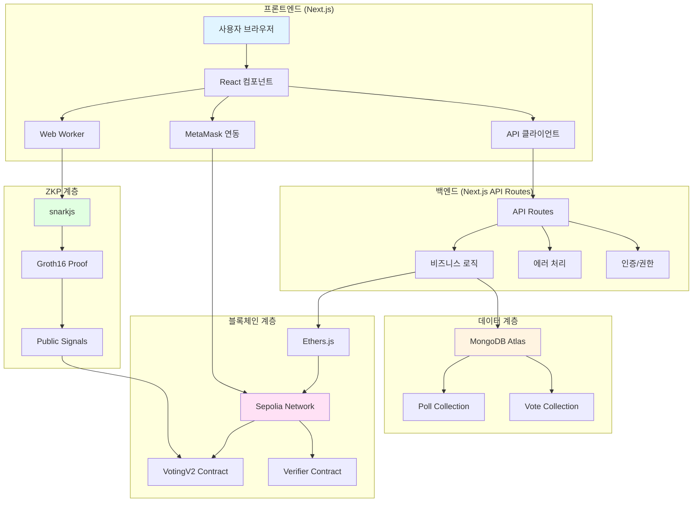
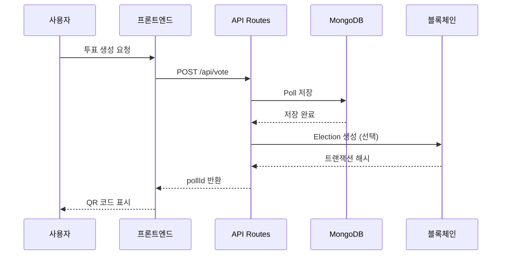
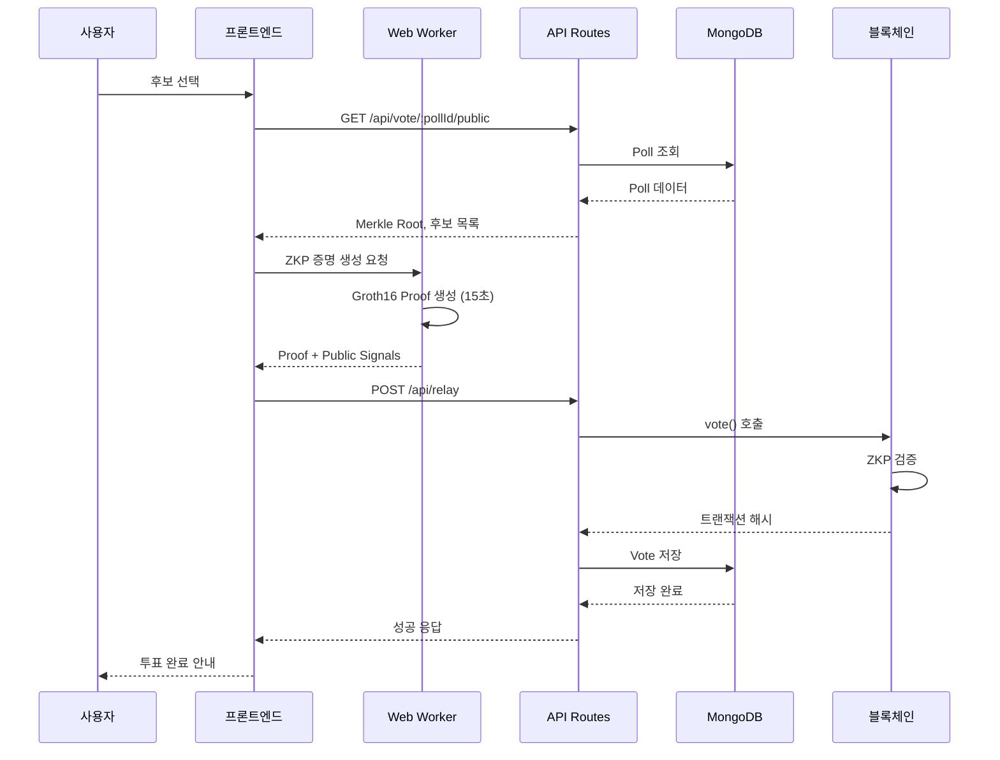
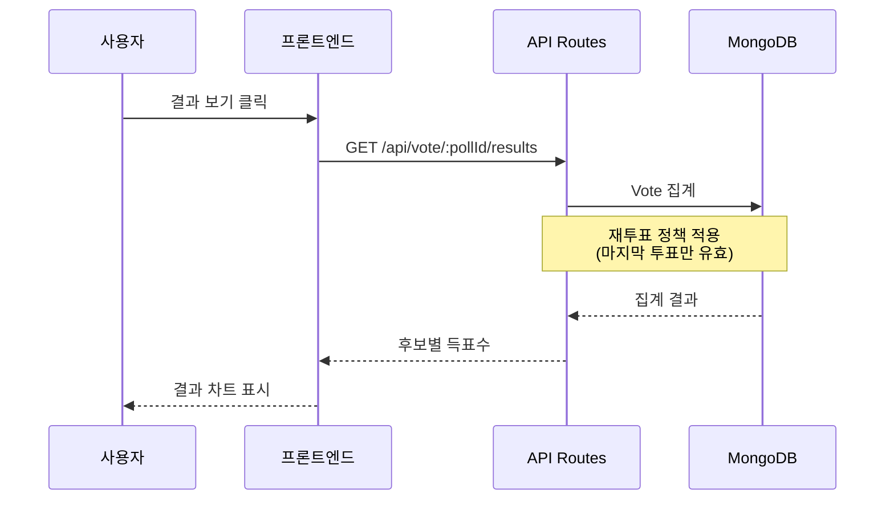
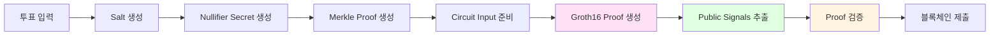
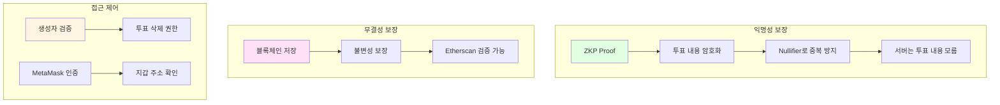

# 🏗️ 시스템 아키텍처

## 전체 시스템 구조

## 데이터 플로우

### 투표 생성 플로우

### 투표 참여 플로우

### 결과 조회 플로우

## ZKP 증명 생성 플로우

## 보안 계층

## 기술 스택

### 프론트엔드
- **Next.js 15**: React 프레임워크
- **TypeScript**: 타입 안정성
- **Zustand**: 상태 관리
- **Ethers.js**: 블록체인 연동

### 백엔드
- **Next.js API Routes**: 서버리스 API
- **MongoDB + Mongoose**: 데이터베이스
- **Zod**: 런타임 검증

### 블록체인
- **Solidity**: 스마트 컨트랙트
- **Hardhat**: 개발 환경
- **Sepolia**: 테스트넷

### ZKP
- **Circom**: 회로 작성
- **snarkjs**: 증명 생성/검증
- **Groth16**: 증명 시스템

## 주요 설계 결정

### 1. 재투표 정책
- 마감 시간 전까지 재투표 가능
- 마지막 투표만 유효 (컨트랙트 및 DB 일치)

### 2. Relayer 패턴
- 사용자는 가스비 지불 불필요
- Relayer가 가스비 대납
- Nonce 큐로 동시성 관리

### 3. 캐싱 전략
- 진행 중 투표: 10초 캐시
- 종료된 투표: 5분 캐시
- 통계: 1분 캐시

### 4. 에러 처리
- 중앙화된 에러 핸들러
- 일관된 에러 응답 형식
- 사용자 친화적 메시지

## 확장성 고려사항

### 현재 구조
- 단일 MongoDB 인스턴스
- 단일 Relayer 지갑
- 클라이언트 사이드 ZKP 생성

### 향후 개선 가능
- MongoDB 샤딩
- Relayer 풀 (로드 밸런싱)
- 서버 사이드 ZKP 생성 (WSL Proof 서버)

